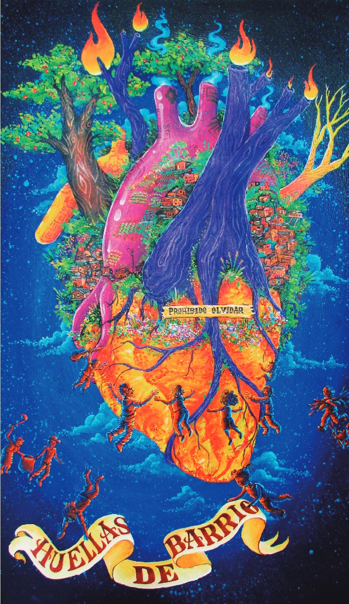
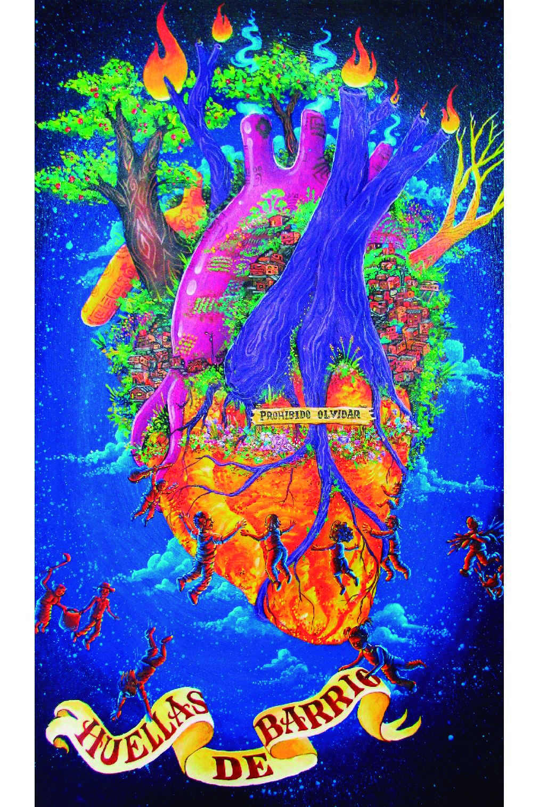

info procesos 

 

      <!-- Tarjetas -->

      

        

          

            Procesos
            <h1> Entre barrios populares  y favelas  </h1>

          

        

      

      

        <!--             inicio publicaciones -->
        

          <!-- card 1 -->
          

            

              

                
              

              <h4 class="text-center">
                2022 - Actual
                 
                CompartirES PopularES
              </h4>
              

                Proceso de investigación-acción-participación, con inicio en 2010, en el
                que han participado habitantes de barrios populares de Medellín, universidades de Medellín y brasileñas,
                servidores públicos del Parque Explora,
                del Sistema de Bibliotecas Públicas de Medellín y del Banco de la República, sede Medellín.
              

              

                <a href="../pages/proyecto-2022-compartires-populares.html" class="btn-pill ">Ver más</a>
              

            

          

          <!--         card 2 -->
          

            

              

                
              

              <h4 class="text-center">2018  
                Transformación de favelas
                en Río de Janeiro-Brasil
                y barrios populares
                de Medellín-Colombia
                por prácticas de turismo</h4>
              

                Se hace memoria de lo propio, se hace memoria de los lugares que sentimos propios,
                a veces nos quitan los lugares que nos pertenecen y nos imponen otros caminos, otros formas de habitar y
                es ejercicio personal y colectivo re-significar las formas de estar en lo nuevo.
              

              

                <a href="../pages/proyecto-2018-transformacion-favelas.html" class="btn-pill ">Ver más</a>
              

            

          

          

            

              

                
              

              <h4 class="text-center">2017   Sentipensar el barrio</h4>
              

                La descripción y espacialización de la memoria urbana de la población que habita el área de influencia
                de la intervención PUI-NOR, realizada en la centralidad de Santo Domingo Savio,
                comuna 1 del Municipio de Medellín (Colombia) entre 2004 y 2011
              

              

                <a href="../pages/proyecto-2017-sentipensar-barrio.html" class="btn-pill">Ver más</a>
              

            

          

          

            

              

                
              

              <h4 class="text-center">2016   La memoría se construye caminando</h4>
              

                La descripción y espacialización de la memoria urbana de la población que habita el área de influencia
                de la intervención PUI-NOR, realizada en la centralidad de Santo Domingo Savio,
                comuna 1 del Municipio de Medellín (Colombia) entre 2004 y 2011
              

              

                <a href="../pages/proyecto-2016-memoria-caminando.html" class="btn-pill">Ver más</a>
              

            

          

          

            

              

                
              

              <h4 class="text-center">2015  
                Barrios populares Medellín y favelas São Paulo</h4>
              

                La descripción y espacialización de la memoria urbana de la población que habita el área de influencia
                de la intervención PUI-NOR, realizada en la centralidad de Santo Domingo Savio,
                comuna 1 del Municipio de Medellín (Colombia) entre 2004 y 2011
              

              

                <a href="../pages/proyecto-2015-barrios-medellin-favelas-sp.html" class="btn-pill">Ver más</a>
              

            

          

          

            

              

                
              

              <h4 class="text-center">2014   Apropiación social del conocimiento</h4>
              

                Entendida como construcción social participativa y contextualizada en torno al conocimiento que
                permite a los sujetos que lo generan, reflexionar, aprehender, usar y potenciar sus saberes
                para la transformación positiva de su realidad (Gutiérrez, et al., 2014)
              

              

                <a href="../pages/proyecto-2014-apropiacion-conocimiento.html" class="btn-pill">Ver más</a>
              

            

          

        

        

          <a href="#" class="btn mt-4 m-auto "
            style="border: 2px solid ;background-color: #004200; color: white; border-radius: 30px;font-size: 30px;">Más
            publicaciones</a>
        

      

      <!-- Nueva Sección Popular-es dentro del contenedor de Barrios populares -->
      

        <!-- Decoraciones -->
        

      

      compartires pages

      <!-- 

          
          
          
 -->

          <!-- Modal para imagen Huellas de Barrio -->
    

      
  

        

          

            <h5 class="modal-title w-100 text-center fw-bold" id="hdbModalLabel">Video clip canción Huellas de Barrio</h3>
            <button type="button" class="btn p-0 m-0 border-0 bg-transparent position-absolute top-0 end-0" data-bs-dismiss="modal" aria-label="Cerrar" style="font-size:2.5rem;z-index:10;">
              <i class="fa-solid fa-xmark p-3" style="color:#949494;"></i>
            </button>
          

          

               <!-- video -->     
      <!-- 

        

          

            <iframe class="text-center w-100" style="height: 20vh; display: block; margin: auto; max-width: 80%;" src="https://www.youtube.com/embed/W9zla7jn9VU?list=RDW9zla7jn9VU&autoplay=1&mute=1&controls=1" title="YouTube video" frameborder="0" allow="accelerometer; autoplay; clipboard-write; encrypted-media; gyroscope; picture-in-picture" allowfullscreen> 
            </iframe>
          

        

      
 -->
      <!-- video -->
    

      

        

          <iframe class="text-center w-100 videoyt" style=" display: block; margin: auto; max-height: 80vh;"
            src="https://www.youtube.com/embed/W9zla7jn9VU?list=RDW9zla7jn9VU&autoplay=1&mute=1&controls=1"
            title="YouTube video" frameborder="0"
            allow="accelerometer; autoplay; clipboard-write; encrypted-media; gyroscope; picture-in-picture"
            allowfullscreen></iframe>
        

      

    

          

        

      

    
    

    ----------------------------------------------//----------------------------------------------------//--------------------------

    carousel

    

        

        

          

            

              <!-- Slide 1: cards 1,2,3 -->
              

                

                  

                    

                      

                        
                      

                      

                        <h5 class="card-title">David Dell</h5>
                        

                          Breve descripción o rol de la persona, acorde al
                          ejemplo visual mostrado.
                        

                        <a class="btn btn-primary btn-sm mt-2" href="#"
                          >View More</a
                        >
                      

                    

                  

                  

                    

                      

                        
                      

                      

                        <h5 class="card-title">Rose Bush</h5>
                        

                          Pequeña descripción que acompañe el título y el botón.
                        

                        <a class="btn btn-primary btn-sm mt-2" href="#"
                          >View More</a
                        >
                      

                    

                  

                  

                    

                      

                        
                      

                      

                        <h5 class="card-title">Jones Gail</h5>
                        

                          Texto corto explicativo sobre la tarjeta o persona.
                        

                        <a class="btn btn-primary btn-sm mt-2" href="#"
                          >View More</a
                        >
                      

                    

                  

                

              

              <!-- Slide 2: cards 2,3,4 -->
              

                

                  

                    

                      

                        
                      

                      

                        <h5 class="card-title">Rose Bush</h5>
                        

                          Pequeña descripción que acompañe el título y el botón.
                        

                        <a class="btn btn-primary btn-sm mt-2" href="#"
                          >View More</a
                        >
                      

                    

                  

                  

                    

                      

                        
                      

                      

                        <h5 class="card-title">Jones Gail</h5>
                        

                          Texto corto explicativo sobre la tarjeta o persona.
                        

                        <a class="btn btn-primary btn-sm mt-2" href="#"
                          >View More</a
                        >
                      

                    

                  

                  

                    

                      

                        
                      

                      

                        <h5 class="card-title">Person 4</h5>
                        
Descripción de la tarjeta 4.

                        <a class="btn btn-primary btn-sm mt-2" href="#"
                          >View More</a
                        >
                      

                    

                  

                

              

              <!-- Slide 3: cards 3,4,1 -->
              

                

                  

                    

                      

                        
                      

                      

                        <h5 class="card-title">Jones Gail</h5>
                        

                          Texto corto explicativo sobre la tarjeta o persona.
                        

                        <a class="btn btn-primary btn-sm mt-2" href="#"
                          >View More</a
                        >
                      

                    

                  

                  

                    

                      

                        
                      

                      

                        <h5 class="card-title">Person 4</h5>
                        
Descripción de la tarjeta 4.

                        <a class="btn btn-primary btn-sm mt-2" href="#"
                          >View More</a
                        >
                      

                    

                  

                  

                    

                      

                        
                      

                      

                        <h5 class="card-title">David Dell</h5>
                        

                          Breve descripción o rol de la persona, acorde al
                          ejemplo visual mostrado.
                        

                        <a class="btn btn-primary btn-sm mt-2" href="#"
                          >View More</a
                        >
                      

                    

                  

                

              

              <!-- Slide 4: cards 4,1,2 -->
              

                

                  

                    

                      

                        
                      

                      

                        <h5 class="card-title">Person 4</h5>
                        
Descripción de la tarjeta 4.

                        <a class="btn btn-primary btn-sm mt-2" href="#"
                          >View More</a
                        >
                      

                    

                  

                  

                    

                      

                        
                      

                      

                        <h5 class="card-title">David Dell</h5>
                        

                          Breve descripción o rol de la persona, acorde al
                          ejemplo visual mostrado.
                        

                        <a class="btn btn-primary btn-sm mt-2" href="#"
                          >View More</a
                        >
                      

                    

                  

                  

                    

                      

                        
                      

                      

                        <h5 class="card-title">Rose Bush</h5>
                        

                          Pequeña descripción que acompañe el título y el botón.
                        

                        <a class="btn btn-primary btn-sm mt-2" href="#"
                          >View More</a
                        >
                      

                    

                  

                

              

            

            <!-- Controls -->
            <button
              class="carousel-control-prev"
              type="button"
              data-bs-target="#cardsCarouselCustom"
              data-bs-slide="prev"
              aria-label="Anterior"
            >
              <i class="fa fa-angle-left ctrl-icon" aria-hidden="true"></i>
              Anterior
            </button>
            <button
              class="carousel-control-next"
              type="button"
              data-bs-target="#cardsCarouselCustom"
              data-bs-slide="next"
              aria-label="Siguiente"
            >
              <i class="fa fa-angle-right ctrl-icon" aria-hidden="true"></i>
              Siguiente
            </button>

            <!-- Indicators centered -->
            

              <button
                type="button"
                data-bs-target="#cardsCarouselCustom"
                data-bs-slide-to="0"
                class="active"
                aria-current="true"
              ></button>
              <button
                type="button"
                data-bs-target="#cardsCarouselCustom"
                data-bs-slide-to="1"
              ></button>
              <button
                type="button"
                data-bs-target="#cardsCarouselCustom"
                data-bs-slide-to="2"
              ></button>
              <button
                type="button"
                data-bs-target="#cardsCarouselCustom"
                data-bs-slide-to="3"
              ></button>
            

          

        

      

      ----------------------------------//--------------------------------------------------//-------------------------------------

<!-- imagenes de presentacion  -->
      

              
            

             

          <!-- Contenedor Bootstrap -->

  

    <table class="table table-bordered align-middle">
      <thead class="table-dark text-center">
        <tr>
          <th>Nombres completos de todos los autores / colaboradores (diseñador, guionista, editor, ilustrador, etc)</th>
          <th>Fecha de publicación</th>
          <th>Link de acceso al producto (si aplica)</th>
          <th>Licencia</th>
        </tr>
      </thead>
      <tbody>
        <tr>
          <td>
            Universidad de Antioquia (Facultad de Ciencias Sociales y Humanas, Departamento de Trabajo Social, grupo de investigación Medio Ambiente y Sociedad-MASO); Banco de la República; Sistema de Bibliotecas Públicas de Medellín; Colectivos comunitarios: Casa para el Encuentro Piedra en el Camino, Teatro Sin Nombre, Junta de Acción Comunal de Santo Domingo Savio, Klan Ghetto Popular-KGP, RA1, In Lack'ech (comuna 1), Corporación Mi comuna (comuna 2), Cartografia_Ando (comuna 6), Mesa Juvenil de La Sierra (comuna 8), Son Batá y Afro Tour (comuna 13).  

            Letra: David Alexis Monsalve Calle, Santiago Salazar Ocampo, Estefanía González López, Sergio Higuita, Fredy Asprilla Jave, Jeffrey Botero. 
            Música: David Alexis Monsalve Calle, Santiago Salazar, Camilo Vallejo, Fredy Asprilla Jave, Andrés Roso. 
            Voz principal: David Alexis Monsalve Calle, Estefanía González López, Harrison Jaramillo, Santiago Salazar Ocampo, Sergio Higuita, Fredy Asprilla Jave, Jeffrey Botero. 
            Coros: David Alexis Monsalve Calle, Estefanía González López, Harrison Jaramillo, Santiago Salazar Ocampo, Sergio Higuita, Fredy Asprilla Jave, Jeff Botero, Jeffrey Botero, David Benavidez 
            Guitarra eléctrica y cuatro: David Alexis Monsalve Calle 
            Bajo: Camilo Vallejo 
            Percusión y teclados: Andrés Roso 
            Zampoña: Estefanía González López 
            Intro: Pastoral Afro barrio La Sierra 
            Arreglos, grabación y mezcla: Andrés Roso 
            Masterización: Mateo Vimens 
            Grabado en RP-Studio, La Estrella, Colombia. Con la colaboración de: Universidad de Antioquia, Corporación Afrocolombiana Son Batá, colectivo Casa de Piedra en el Camino, Cartografi_Ando, Teatro Sin Nombre, Mesa Juvenil La Sierra Es Otro Cuento. 
            Producido por Red Huellas de Barrio. 
            Realizadores del videoclip: Sergio Higuita Úsuga, Mateo Vimens, Juliana Castañeda 
            *Todos los derechos reservados.
          </td>
          <td class="text-center">1 de agosto de 2025</td>
          <td>
            <a href="https://www.popular-esmedellin.com/" target="_blank">
              https://www.popular-esmedellin.com/
            </a>
          </td>
          <td class="text-center">Imagen</td>
        </tr>

        <tr>
          <td>
            Universidad de Antioquia (Facultad de Ciencias Sociales y Humanas, Departamento de Trabajo Social, grupo de investigación Medio Ambiente y Sociedad-MASO), Sistema de Bibliotecas Públicas de Medellín; Colectivos comunitarios: Casa Piedra en el Camino (Comuna 1), Bibliocielo (Comuna 1), Calle & Tinta, Corporación Mi comuna (comuna 2), Mesa Juvenil de La Sierra (comuna 8), Ludobiblioteka Manuel Burgos  

            Diseño: Juan Obed Yepes 
            Artistas: Calle & Tinta 
            Fotografías: El Megáfono y Colectivos Comunitarios 
            *Todos los derechos reservados.
          </td>
          <td class="text-center">Viernes 29 de 2025 al 30 de marzo de 2025</td>
          <td>
            <a href="https://www.popular-esmedellin.com/" target="_blank">
              https://www.popular-esmedellin.com/
            </a>
          </td>
          <td class="text-center">Imagen</td>
        </tr>

        <tr>
          <td>
            Universidad de Antioquia (Facultad de Ciencias Sociales y Humanas, Departamento de Trabajo Social, grupo de investigación Medio Ambiente y Sociedad-MASO), Sistema de Bibliotecas Públicas de Medellín, ENGIM Colombia, Parroquia Santa María de La Sierra; Colectivos comunitarios: Casa Piedra en el Camino (Comuna 1), Bibliocielo (Comuna 1), Calle & Tinta, Corporación Mi comuna (comuna 2), Mesa Juvenil de La Sierra (comuna 8), Ludobiblioteka Manuel Burgos (Comuna 3)  

            Ilustración: Juan Obed Yepes con base en espacios de ideación comunitaria 
            Artistas: Calle & Tinta 
            Fotografías: Engim Colombia 
            *Todos los derechos reservados.
          </td>
          <td class="text-center">3 de marzo de 2025</td>
          <td>
            <a href="https://www.popular-esmedellin.com/" target="_blank">
              https://www.popular-esmedellin.com/
            </a>
          </td>
          <td class="text-center">imagen</td>
        </tr>

        <tr>
          <td>
            Universidad de Antioquia (Facultad de Ciencias Sociales y Humanas, Departamento de Trabajo Social, grupo de investigación Medio Ambiente y Sociedad-MASO), Sistema de Bibliotecas Públicas de Medellín; Colectivos comunitarios: Casa Piedra en el Camino (Comuna 1), Bibliocielo (Comuna 1), Calle & Tinta, Corporación Mi comuna (comuna 2), Mesa Juvenil de La Sierra (comuna 8), Ludobiblioteka Manuel Burgos (Comuna 3)  

            Diseño: 
            Ilustración "El corazón del barrio", Juan Obed Yepes 
            Diagramación: Saray Manuela Grajales Morales
          </td>
          <td class="text-center">Marzo de 2025</td>
          <td>
            <a href="https://www.popular-esmedellin.com/" target="_blank">
              https://www.popular-esmedellin.com/
            </a>
          </td>
          <td class="text-center">imagen</td>
        </tr>

        <tr>
          <td>
            Universidad de Antioquia (Facultad de Ciencias Sociales y Humanas, Departamento de Trabajo Social, grupo de investigación Medio Ambiente y Sociedad-MASO), Sistema de Bibliotecas Públicas de Medellín; Colectivos comunitarios: Casa Piedra en el Camino (Comuna 1), Bibliocielo (Comuna 1), Calle & Tinta, Corporación Mi comuna (comuna 2), Mesa Juvenil de La Sierra (comuna 8), Ludobiblioteka Manuel Burgos (Comuna 3)  

            Autor: Christian Giovanny Álvarez López
          </td>
          <td class="text-center">dic-25</td>
          <td>
            <a href="https://www.micomunados.com/lo-que-no-aparece-en-la-postal-invisibilidades-del-turismo-en-la-medellin-popular/" target="_blank">
              https://www.micomunados.com/lo-que-no-aparece-en-la-postal-invisibilidades-del-turismo-en-la-medellin-popular/
            </a>
          </td>
          <td class="text-center">Imagen</td>
        </tr>

        <tr>
          <td>
            Universidad de Antioquia (Facultad de Ciencias Sociales y Humanas, Departamento de Trabajo Social, grupo de investigación Medio Ambiente y Sociedad-MASO), Sistema de Bibliotecas Públicas de Medellín; Colectivos comunitarios: Casa Piedra en el Camino (Comuna 1), Bibliocielo (Comuna 1), Calle & Tinta, Corporación Mi comuna (comuna 2), Mesa Juvenil de La Sierra (comuna 8), Ludobiblioteka Manuel Burgos (Comuna 3)  

            Diseño: Saray Manuela Grajales 
            Ilustración corazón: Juan Obed Yepez 
            Diagramación y diseño: Saray Manuela Grajales Morales 
            Aliado principal: Biblioteca Comunitaria Bibliocielo y Biblioteteka Manuel Burgos 
            Participantes del laboratorio de creación: niños y niñas de la Bibliteca comunitaria Bibliocielo y participantes de Semilla Somos, espacio de cuidado de la Huerta comunitaria del barrio Bello Oriente
          </td>
          <td class="text-center">Noviembre 16 de 2025</td>
          <td>
            <a href="https://www.popular-esmedellin.com/" target="_blank">
              https://www.popular-esmedellin.com/
            </a>
          </td>
          <td class="text-center">Imagen</td>
        </tr>
      </tbody>
    </table>
  

  

          

          

               <!-- video -->
    

      

        

          <iframe class="text-center w-50 videoyt" style=" display: block; margin: auto; max-height: 100;"
            src="https://www.youtube.com/embed/W9zla7jn9VU?list=RDW9zla7jn9VU&autoplay=1&mute=1&controls=1"
            title="YouTube video" frameborder="0"
            allow="accelerometer; autoplay; clipboard-write; encrypted-media; gyroscope; picture-in-picture"
            allowfullscreen></iframe>
        

      

    

     

    

    

      

        

             <h3 class="mt-4"> Huellas de Barrio: red popular, sentipensante y actuante</h3>
              

                <strong>Resumen:</strong> La transformación y afectación del cotidiano de los barrios populares de Medellín por prácticas de turismo es el contexto en el que emerge el colectivo Huellas de Barrio, una red de ciudad constituida en 2018, con antecedentes de procesos participativos desde el 2016. Esta reúne personas de instituciones públicas gubernamentales, de universidades, organizaciones sociales y colectivos comunitarios presentes en barrios populares de las comunas 1 Popular, 2 Santa Cruz, 3 Manrique, 6 Doce de Octubre, 8 Villa Hermosa, y 13 San Javier de Medellín-Colombia de manera solidaria. Su despliegue ha sido fundado como proceso formativo, expositivo, gestor y multiplicador de conversaciones que se extendieron desde las localidades de los barrios habitados por cada participante hasta los escenarios de ciudad para observar, sentir, revelar y plantear los problemas y alternativas en defensa de lo humano, de lo colectivo y de la vida digna.
              

    
              

                Esta juntanza multiplicadora, hoy vigente, desde su conformación fue grito de revisión de las formas de relacionamiento reproductoras de desigualdades en la producción de conocimiento, allí el cuidado y el afecto se desplegaron como el protocolo común para hacer frente a las preguntas iniciales y garantizar la permanencia de la acción colectiva. El recurso audiovisual es un relato a voces de la experiencia de Huellas de Barrio tras la presencia enmascarada del mercado en el turismo y la transformación de las prácticas cotidianas en la ciudad popular. Un proceso que fue incentivo para poner en entredicho las formas serias y solitarias de la producción de conocimiento y celebrar la construcción de confianza, la intimidad y la amistad como fuerza metodológica para encontrar caminos a los retos de la ciudad hoy.
              

        

        

        

            
          

          

            
          

    

            
          

          

            
          

          
           

            <!-- Modal para ampliar imágenes de la galería doble -->
    

      

        

          

            <button id="carouselPrev" class="btn btn-dark position-absolute top-50 start-0 translate-middle-y" style="z-index:2;"><i class="fa fa-chevron-left fa-2x"></i></button>
            
            <button id="carouselNext" class="btn btn-dark position-absolute top-50 end-0 translate-middle-y" style="z-index:2;"><i class="fa fa-chevron-right fa-2x"></i></button>
          

          

            <button type="button" class="btn btn-secondary" data-bs-dismiss="modal">Cerrar</button>
          

        

      

    

<!-- Modal Documento Completo -->

  

    

      

        <h5 class="modal-title" id="docModalLabel">Documento completo</h5>
        <button type="button" class="btn-close" data-bs-dismiss="modal" aria-label="Cerrar"></button>
      

      

        <!-- Aquí puedes agregar el contenido del documento, PDF embebido, texto, enlaces, etc. -->
        
        

          <iframe src="../recursos/docs/PlantillaFinal_Inventario productos ASC - Repositorio Biblioteca_definitivo.pdf" width="100%" height="700px" style="border:none;" allowfullscreen></iframe>
        

      

      

        <button type="button" class="btn btn-secondary" data-bs-dismiss="modal">Cerrar</button>
      

    

  

        
    
          

         

         <h3 class="mt-4"> Huellas de Barrio: red popular, sentipensante y actuante</h3>
              

                <strong>Resumen:</strong> La transformación y afectación del cotidiano de los barrios populares de Medellín por prácticas de turismo es el contexto en el que emerge el colectivo Huellas de Barrio, una red de ciudad constituida en 2018, con antecedentes de procesos participativos desde el 2016. Esta reúne personas de instituciones públicas gubernamentales, de universidades, organizaciones sociales y colectivos comunitarios presentes en barrios populares de las comunas 1 Popular, 2 Santa Cruz, 3 Manrique, 6 Doce de Octubre, 8 Villa Hermosa, y 13 San Javier de Medellín-Colombia de manera solidaria. Su despliegue ha sido fundado como proceso formativo, expositivo, gestor y multiplicador de conversaciones que se extendieron desde las localidades de los barrios habitados por cada participante hasta los escenarios de ciudad para observar, sentir, revelar y plantear los problemas y alternativas en defensa de lo humano, de lo colectivo y de la vida digna.
              

    
              

                Esta juntanza multiplicadora, hoy vigente, desde su conformación fue grito de revisión de las formas de relacionamiento reproductoras de desigualdades en la producción de conocimiento, allí el cuidado y el afecto se desplegaron como el protocolo común para hacer frente a las preguntas iniciales y garantizar la permanencia de la acción colectiva. El recurso audiovisual es un relato a voces de la experiencia de Huellas de Barrio tras la presencia enmascarada del mercado en el turismo y la transformación de las prácticas cotidianas en la ciudad popular. Un proceso que fue incentivo para poner en entredicho las formas serias y solitarias de la producción de conocimiento y celebrar la construcción de confianza, la intimidad y la amistad como fuerza metodológica para encontrar caminos a los retos de la ciudad hoy.
              

        

        

  

    

      

        

          <h5 class="card-title">Videoclip "Huellas de Barrio"</h5>
          

            La canción Huellas de Barrio es resultado de la reunión de diferentes ritmos musicales y de artistas de comunas del Distrito de Ciencia Tecnología e innovación de Medellín, Departamento de Antioquia, Colombia. Además de compartir la pasión por el arte, tienen en común un interés decidido por la defensa de sus barrios mediante la bandera del arte. El contenido de este videoclip es producto de un proceso formativo crítico realizado entre 2018 y 2022, en el cual confluyen espacios de reflexión sobre diferentes temáticas y recorridos territoriales con énfasis en cuidado de los barrios.
          

        

      

    

    

      

        

          <h5 class="card-title">Mural: SentirEs PopularEs </h5>
          

            En el marco de la inauguración del Salón Juvenil de la Parroquia Santa María La Sierra, el arte urbano popular posibilitó un espacio abierto para que habitantes del barrio La Sierra y representantes de instituciones como Engim, UdeA (estudiantes de trabajo social), Huellas de Barrio, congregación Giuseppini di Murialdo, Mesa Juvenil La Sierra es Otro Cuento, Parque Biblioteca La Ladera; se reunieran en un espacio público para jugar, hacer manualidades, leer y escribir, pintar, estampar, diseñar y comer. Una toma cultural de encuentro intergeneracional posibilitó la reflexión del cuidado del barrio con apropiación de lo público como bien común.

             
            

          

        

      

    

     

      

        

          <h5 class="card-title">El corazón del barrio II. Oficios y haceres populares </h5>
          

          
             Obra materializada en el diseño de un mural de 2x4metros ubicado en el barrio Santo Domingo Savio en la plazoleta pública del Parque Biblioteca Nororiental. Esta creación exalta el valor de las acciones y prácticas cotidianas de los habitantes de barrios populares como símbolos de apropiación de la memoria colectiva y resistencia a la visión globalizada de desarrollo y a la histórica ausencia estatal, por ello plasma los convites, los liderazgos y las festividades comunitarias, actividades que fomentan el cuidado de lo común y vinculan a la comunidad en acciones colectivas que fomentan la paz territorial y el cuidado barrial. Participaron habitantes, colectivos comunitarios como Casa Galeria, Trash Art, El Megáfono, Red Árbol Bello Oriente, representantes del Parque Biblioteca Nororiental, colectivo profesoral y estudiantil de la Universidad de Antioquia (grupo MASO)
            

          

        

      

    

    

    

      

        

          <h5 class="card-title">Fanzine</h5>
          

            Producto colaborativo realizado con población infantil que reúne reflexiones en torno a los patrimonios populares barriales. Implicó el desarrollo de un proceso participativo con niños y niñas entre los 6 y los 14 años mediante encuentros de lectura, escritura, juego y dinamización para conversar sobre el cuidado del barrio. Fue un proceso de base comunitaria y autogestionado.
          

        

      

    

    

      

        

          <h5 class="card-title">Artículo en medio comunitario </h5>
          

            Artículo periodístico en medio comunitario "Lo que no aparece en la postal: Invisibilidades del turismo en la Medellín popular". Con esta publicación se busca impactar directamente a público no especializado, ofreciendo información sobre cotidianos barriales que aportan a diagnósticos territoriales. 
          

        

      

    

  

 <!-- Sección Donations -->
               <!-- 

                    <h6 class="text-light">Enlaces de interés</h6>
                    <ul class="list-unstyled fs-5">
                        <li><a href="https://www.udea.edu.co/wps/portal/udea/web/inicio/institucional/unidades-administrativas/vicerrectoria-investigacion"
                                target="_blank">Vicerectoría de Investigación UdeA</a></li>
                        <li><a href="https://www.udea.edu.co/wps/portal/udea/web/inicio/institucional/unidades-administrativas/vicerrectoria-investigacion"
                                target="_blank">Universidad de Antioquia</a></li>
                        <li><a href="https://bibliotecasmedellin.gov.co/" target="_blank">Sistema de Bibliotecas
                                públicas de
                                Medellín</a></li>
                        <li><a href="https://micomuna.org/" target="_blank">Corporación Mi Comuna</a></li>
                        <li></li>
                        <li></li>
                    </ul>
                

                -->